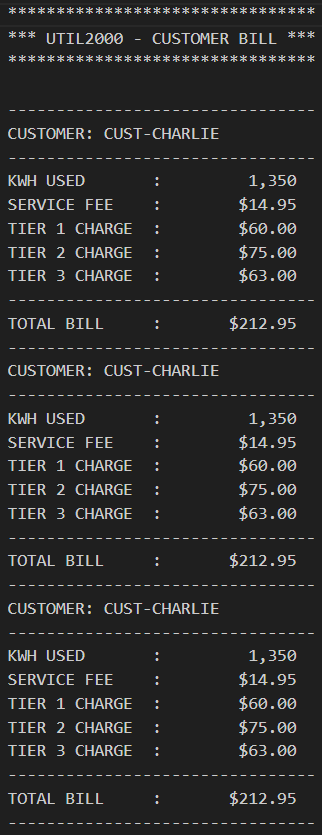

# COBOL UTIL2000
___
## Overview
___
This COBOL program calculates customer utility bills based on a three-tier rate scale. The program ensures accurate billing by applying different rates as energy consumption increases, reflecting standard utility pricing models.
## Table of Contents
___
* [Tech Stack](#tech-stack)
* [Installation](#installation)
* [Running Output](#running-output)
* [Help](#help)
* [Authors](#authors)
## Tech Stack
___
* 
* 
* 
## Installation
___
1. Clone the repository to your local machine.
2. Put the code into VS Code in your mainframe of choice
## Running Output
___

## Help
___
* Make sure compiler is running correctly.
* Potentially re-clone repository
* Restart IDE
## Author

**Jacob Schamp**
* **Jacob's GitHub Profile**: [jascha10](https://github.com/jascha10)
___
* **Jacob's GitHub Repo**: [Ch2Util1000](https://github.com/jascha10/Ch2Util1000)

[Back to the top](#overview)
